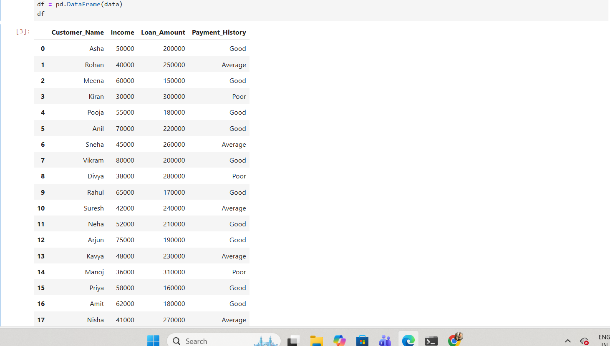

# Credit-Score-Analysis
Credit Score Analysis using Python

##Project Overview
This project focuses on credit risk analysis using Python from a Data Analytics perspective.
It evaluates customer creditworthiness by analyzing income, loan amount, and payment history, and classifies customers into different credit categories.
The project helps simulate real-world financial decision-making used by banks and NBFCs for loan approvals and risk management.

##Tools & Technologies
Python
Pandas
NumPy
Matplotlib
Jupyter Notebook

##Dataset Overview
📂 Dataset Preview

The dataset contains customer financial information including:
Customer Name
Income
Loan Amount
Payment History
Dataset Preview

 ##Loan-to-Income Ratio Analysis
The Loan-to-Income Ratio (LTI) is calculated as:
Copy code

Loan_to_Income_Ratio = Loan_Amount / Income
This metric helps assess how risky a loan is relative to a customer’s income.

##Credit Scoring Logic
Customers are classified into credit categories based on:
Loan-to-Income Ratio
Payment History
Credit Categories
Good → Low loan burden & good payment history
Average → Medium risk
Poor → High loan burden or poor payment history
Numeric credit scores are generated on a 300–900 scale, similar to real-world credit scoring models.

## Summary Analysis
The project generates analytical insights such as:
Credit category distribution
Average loan-to-income ratio by credit category
Risk segmentation of customers
These insights help understand overall credit risk distribution.

##💡 Key Insights
Customers with low loan-to-income ratios mostly fall under the Good credit category
Higher loan burden increases default risk
Poor payment history significantly impacts credit score
Credit categorization helps lenders prioritize low-risk customers

##Business Use Case
This project can be used by financial institutions to:
Assess customer credit risk
Support loan approval decisions
Segment customers based on financial stability
Improve credit risk management strategies

##  How to Run the Project
1. Install required libraries:
pip install pandas numpy matplotlib
2. Open credit_score_analysis.ipynb in Jupyter Notebook
3. Run all cells sequentially

---

