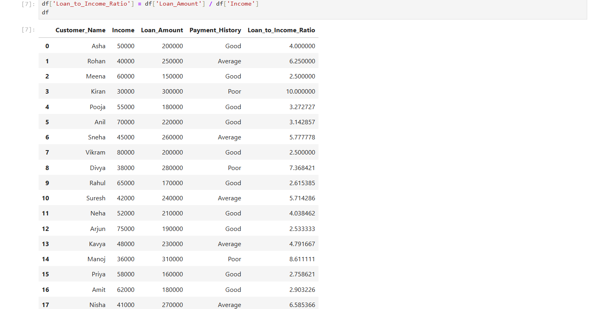
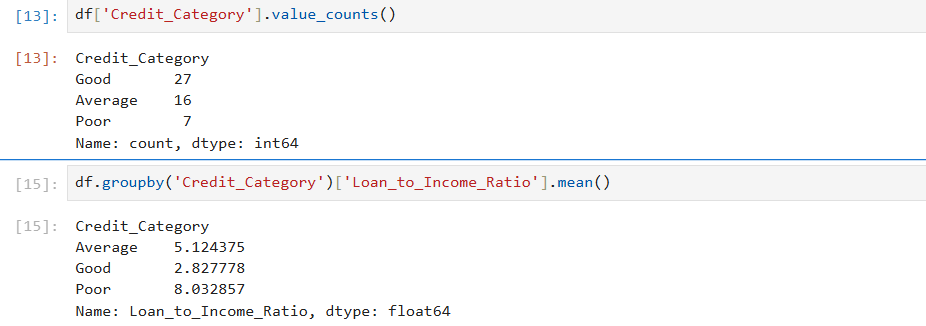

# Credit-Score-Analysis
Credit Score Analysis using Python

## Project Overview
This project performs credit score analysis using Python from a Data Analytics perspective.
It evaluates customer creditworthiness based on income, loan amount, and payment history.
The project calculates financial ratios, assigns credit categories, generates numeric credit scores,
and segments customers based on risk.

---

## Tools & Technologies
- Python
- Pandas
- NumPy
- Matplotlib
- Jupyter Notebook

##  Dataset Overview
The dataset contains customer financial details such as:
- Customer_Name
- Income
- Loan_Amount
- Payment_History

- Below is a preview of the dataset used in the project:

---

## Loan-to-Income Ratio
Loan-to-Income Ratio is calculated using:
Loan_to_Income_Ratio = Loan_Amount / Income
Copy code

This metric helps assess how risky a loan is relative to customer income.

---

## Credit Scoring Logic
Customers are classified into credit categories based on:
- Loan-to-Income Ratio
- Payment History

### Credit Categories
- *Good*: Low ratio and good payment history  
- *Average*: Medium ratio or average payment history  
- *Poor*: High ratio or poor payment history  

Numeric credit scores are generated on a *300–900 scale*.

---

## Summary Analysis
The project includes analytical insights such as:
- Credit category distribution
- Average loan-to-income ratio by credit category

These summaries help understand overall risk distribution.

##  How to Run the Project
1. Install required libraries:
pip install pandas numpy matplotlib
Copy code

2. Open credit_score_analysis.ipynb in Jupyter Notebook
3. Run all cells sequentially

---

## Business Use Case
This project helps financial institutions to:
- Assess customer credit risk
- Segment customers based on financial stability
- Support loan approval decisions
- Improve risk management strategies

